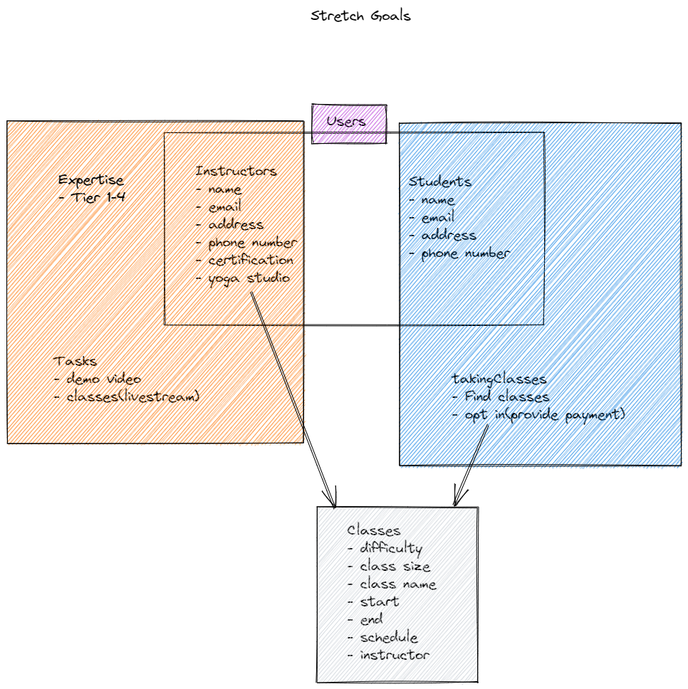
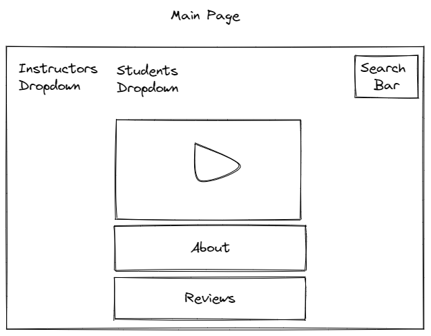
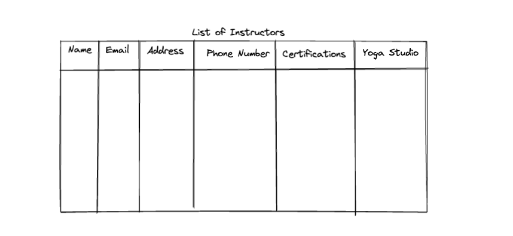
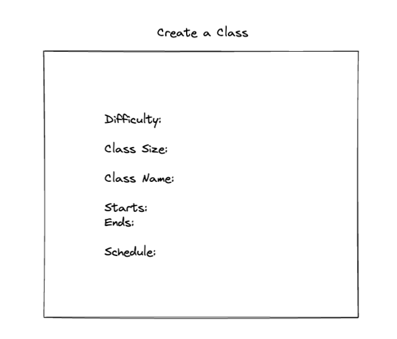
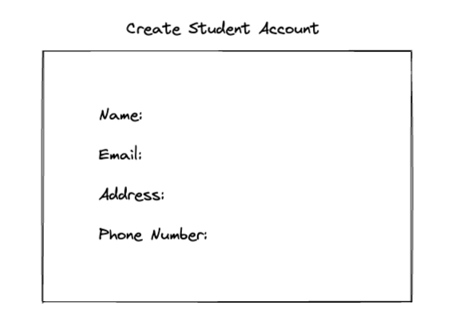
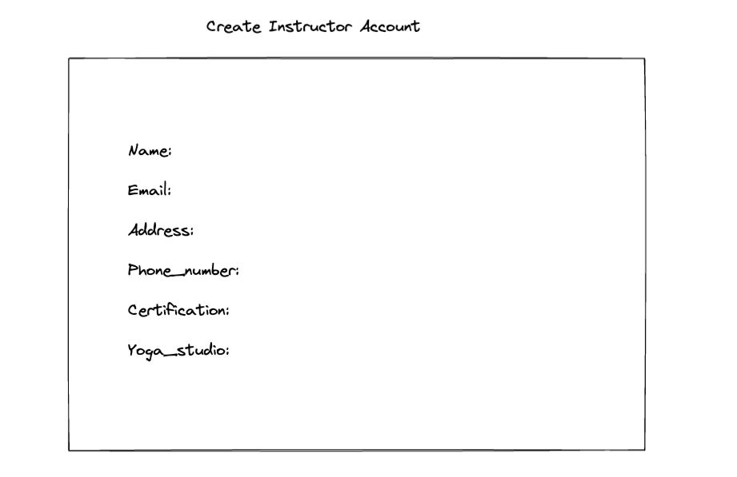

# Graphical Human Interface

## overall project

A sketch of the functionality of the website

## main page

This is the main page that people will see when they
get to the Web site.

## list of classes

Getting a list of classes with each of the model form fields
provided in a table. Returns a list of classes in dictionary format.

## list of instructors

Getting a list of instructors with each of the model form fields
provided in a table. Returns a list of instructors in dictionary format.

## create class

Creating a new class using a form with fields. It returns
all of the form fields with the new database id.

## create student account

Creating a new student account using a form with fields. It returns
all of the form fields with the new database id.

## create instructor account

Creating a new instructor using a form with fields.
It returns all of the form fields with the new database id.

